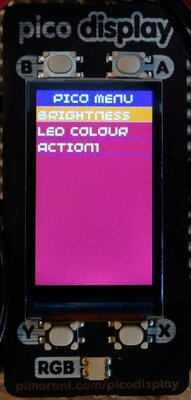
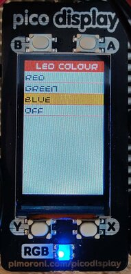
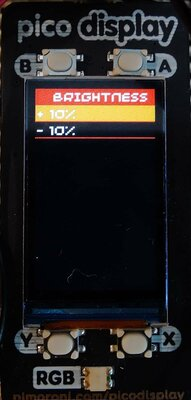
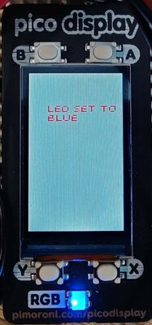

# 2bytes Pico Menu for Pimoroni Pico Display and Raspberry Pi Pico

## Requirements
* Download and setup the Raspberry Pi Pico C++ SDK
* Export `PICO_SDK_PATH` with the path to the SDK
* Get the Pimoroni SDK from [Github](https://github.com/hamid-elaosta/pimoroni-pico) or use the Pimoroni original if/when they merge the PR for portrait mode.
* Export `PIM_SDK_PATH` to point at the Pimoroni SDK

## Usage

See [example/](example/)

```C++
// Create a buffer for the screen
uint16_t buffer[PicoDisplay::PORTRAIT_WIDTH*PicoDisplay::PORTRAIT_HEIGHT];
// Create an instance of PicoDisplay (Portrait only at present)
PicoDisplay display(buffer, PicoDisplay::PORTRAIT_WIDTH, PicoDisplay::PORTRAIT_HEIGHT);
// Create an instance of PicoMenu
twobytes::PicoMenu menu(PicoDisplay::PORTRAIT_WIDTH, PicoDisplay::PORTRAIT_HEIGHT, display);


// Sample action functions
void brightnessUp(){
    // increase brightness
}
void brightnessDown(){
    // decrease brightness
}

void main() {

    // Initialise the display
    display.init();
    display.set_backlight((255/100)*50); // Set backlight to 50%

    // Create the main menu
    twobytes::MenuList topMenu{};
    topMenu.SetTitle("Pico Menu");

    // Optionally, set the background, foreground, title background and title foreground colours, otherwise defaults will be used
    topMenu.SetTitleBackground(twobytes::MenuBase::create_pen(140,0,200)); // #600080
    topMenu.SetTitleForeground(twobytes::MenuBase::create_pen(255,255,255)); // #FFFFFF
    topMenu.SetBackground(twobytes::MenuBase::create_pen(200,0,200)); // #800080
    topMenu.SetForeground(twobytes::MenuBase::create_pen(255,255,255)); // #FFFFFF

    // Add submenus and/or actions
    twobytes::MenuList brightnessMenu{};
    brightnessMenu.SetTitle("Brightness");

    brightnessMenu.SetBackground(twobytes::MenuList::create_pen(0,0,0));
    brightnessMenu.SetForeground(twobytes::MenuList::create_pen(255,255,255));

    // Create some new actions
    twobytes::MenuAction actionUp{};
    twobytes::MenuAction actionDown{};

    // Configure actions by setting title, description and function to execute.
    actionUp.SetTitle("+ 10%");
    actionUp.SetFunction(brightnessUp);
    actionUp.SetDescription("Brightness increased by 10%");

    actionDown.SetTitle("- 10%");
    actionDown.SetFunction(brightnessDown);
    actionDown.SetDescription("Brightness decreased by 10%");

    // Push the brightness actions to the brightness menu.
    brightnessMenu.AddRow(&actionUp);
    brightnessMenu.AddRow(&actionDown);

    // Push the brightnessMenu to the top menu
    topMenu.AddRow(&brightnessMenu);

    // Add your top menu to the PicoMenu instance
    menu.SetMenu(&topMenu);

    // Once we've created all of our menus and actions and added them, we only need to call menu.update() in a loop.
    while (true) {
        menu.Update();
    }

}
```

"Screen" shots :D

  
